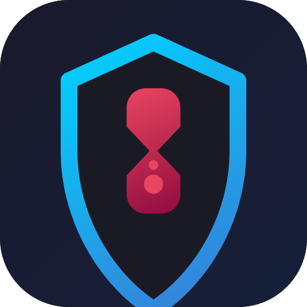

<p align="center">
  
</p>

<h1 align="center">SelfControl</h1>

<p align="center">
  A self-discipline Android app that limits your screen time on the apps <em>you</em>
  choose — daily quotas, curfews, per-unlock sessions and a "nuclear" mode.<br>
  <strong>No root, no Device Owner, no special privileges.</strong>
</p>

<p align="center">
  <a href="#features">Features</a> ·
  <a href="#how-it-works">How it works</a> ·
  <a href="#installation">Installation</a> ·
  <a href="#first-time-setup">Setup</a> ·
  <a href="docs/ARCHITECTURE.md">Docs</a>
</p>

---

## What it is

SelfControl watches the foreground app through an **AccessibilityService**. As soon as an app
exceeds a rule you defined, you're sent back to the home screen. The goal isn't an unbreakable
lock — it's to add just enough friction to break the "open Instagram on autopilot" reflex.

> **Read this first.** SelfControl is a *self-discipline* tool, not tamper-proof parental control.
> Without system privileges, a determined user can disable the accessibility service in Settings
> or uninstall the app. It re-protects itself (intercepts the sensitive Settings pages) and
> restarts on boot, but it adds friction — it is not an absolute lock.

## Screenshots

<p align="center">
  
  &nbsp;
  
  &nbsp;
  
</p>

<!-- Add your screenshots under assets/screenshots/ — see assets/screenshots/README.md -->

## Features

- ⏱️ **Daily quota** per app (e.g. 30 min/day of Instagram).
- 🌙 **Curfews** — time windows where a group of apps is blocked (e.g. social media blocked
  10 pm–7 am), with optional notification muting.
- 📅 **Allowed days / hours** per app.
- 🔁 **Session limits** (Discord-style) — duration per opening + an enforced cooldown between
  openings + a maximum number of openings per day.
- ☢️ **Nuclear Mode** — reinforced temporary block of a set of apps, with named presets.
- 🕒 **Anti-cheat delay** — loosening a limit only takes effect after a delay; tightening it is
  immediate.
- 🔄 **Persistent** — survives reboots and service kills (restarts on boot + watchdog).

## How it works

Two components work together:

- **`AppWatcherService`** (AccessibilityService) detects the foreground app and forces a return
  to the home screen when an app is blocked.
- **`LimitService`** (foreground service) evaluates the rules every second and decides which apps
  must be blocked.

Full details in [`docs/ARCHITECTURE.md`](docs/ARCHITECTURE.md).

## Requirements

- Android **8.0 (API 26)** or newer.
- To build: **JDK 17** and the **Android SDK** (API 34). No rooted device required.

## Installation

### Build the APK

```bash
git clone <repo-url>
cd selfcontrol
./gradlew assembleDebug          # Windows: .\gradlew.bat assembleDebug
```

> If Gradle can't find your SDK, create a `local.properties` file at the root with its path:
> `sdk.dir=/path/to/Android/Sdk` (or `C:\\Users\\you\\AppData\\Local\\Android\\Sdk`).

The APK is produced at `app/build/outputs/apk/debug/app-debug.apk`.

### Install on the phone

Plug in the phone (USB debugging on), then:

```bash
adb install -r app/build/outputs/apk/debug/app-debug.apk
```

(Or copy the APK to the phone and install it manually.)

## First-time setup

Open the app, then grant the requested permissions from its home screen:

1. **Accessibility** — *required*. This is the core of the app (foreground detection + blocking).
   Settings → Accessibility → SelfControl → Enable.
2. **Usage access** — *required* to measure screen time.
3. **Notifications** (Android 13+) — for the service notifications.
4. **Notification access** *(optional)* — to mute notifications from blocked apps.
5. **Do Not Disturb** *(optional)* — used by Nuclear Mode.

The app walks you through each one. Once accessibility and usage access are granted, the service
starts automatically.

## Usage

Everything is configured from within the app: add an app, set its quota, its allowed days/hours,
an optional session limit, and define your curfews. No file editing required.

If you're curious, the rules are stored in a `limits.json` file whose format is documented in
[`docs/CONFIGURATION.md`](docs/CONFIGURATION.md) (example:
[`examples/limits.example.json`](examples/limits.example.json)).

## Documentation

| Document | Contents |
|---|---|
| [`docs/ARCHITECTURE.md`](docs/ARCHITECTURE.md) | How it works internally (the two services, the rules, persistence) |
| [`docs/CONFIGURATION.md`](docs/CONFIGURATION.md) | `limits.json` format (quotas, curfews, sessions) |
| [`docs/SESSION_LIMIT.md`](docs/SESSION_LIMIT.md) | Detailed semantics of session limits |
| [`docs/NUCLEAR_PRESETS.md`](docs/NUCLEAR_PRESETS.md) | Nuclear Mode and presets |
| [`docs/APPWATCHER_SAMSUNG_COMPAT.md`](docs/APPWATCHER_SAMSUNG_COMPAT.md) | Samsung OneUI specifics for the accessibility protection |

## Contributing & feedback

Issues and pull requests are welcome — bug reports, feature ideas, device compatibility notes,
anything. Feel free to fork it and make it your own.

## License

Released under the [MIT License](LICENSE) — free to use, modify and redistribute.
